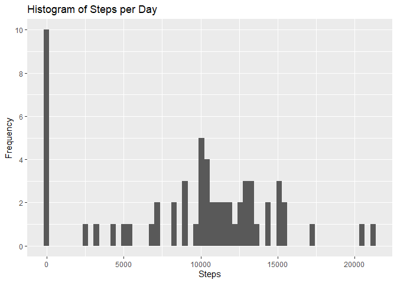
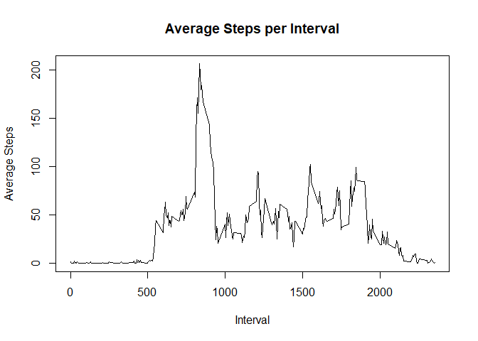
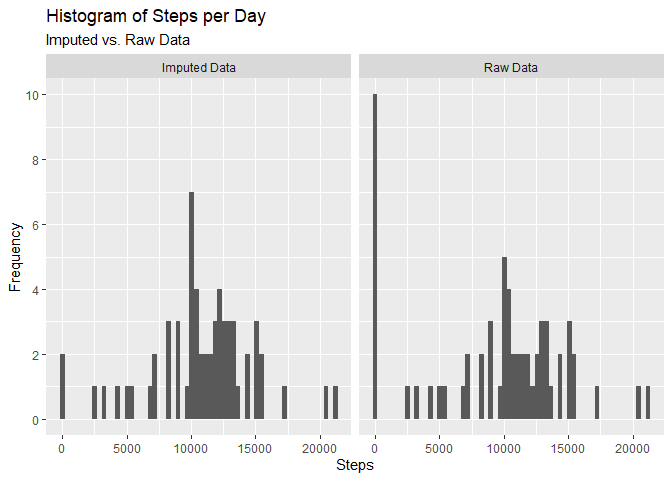
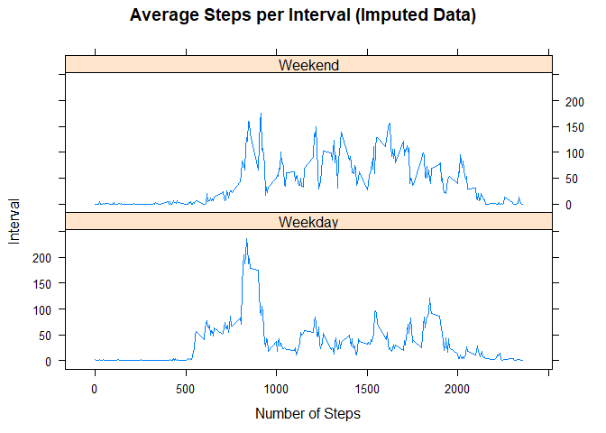

## Loading and preprocessing the data

### 1. Code for reading in the dataset and/or processing the data

*Read the dataset from working directory.*

```r
activity <- read.csv(unz("activity.zip", "activity.csv"), 
                     header = TRUE, 
                     na.strings="NA")
```

*Create single date-time variable*

```r
library(lubridate)
library(dplyr)
options(dplyr.summarise.inform = FALSE)
activity <- activity %>% 
            mutate(datetime = parse_date_time(paste(date,
                            paste(substr(sprintf("%04d",activity$interval),1,2),
                                  substr(sprintf("%04d",activity$interval),3,4),
                                  sep=":"),sep=" "),
                                  "ymd_HM"))
```

------------

## What is mean total number of steps taken per day?

### 2. Histogram of the total number of steps taken each day

*Use `ggplot2` to create histogram of aggregated steps per day*

```r
library(ggplot2)
ggplot(data=activity %>%
      group_by(date) %>%
      summarize(steps = sum(steps, na.rm=TRUE)), (aes(x=steps))) +
      geom_histogram(bins=60) + 
      labs(x="Steps", title="Histogram of Steps per Day") +
      scale_y_continuous(breaks = seq(0,12,by=2),"Frequency")
```

<!-- -->

Of the 61 days in the data, the histogram shows that about 1/6 of the days have 0 steps taken. Without those days, the distribution looks fairly normal, although it may be bimodal.

------------

### 3. Mean and median number of steps taken each day

```r
st <- c("Mean", "Median")
daymean <- sprintf(activity %>% 
                       group_by(date) %>% 
                       summarize(steps = sum(steps,na.rm=TRUE)) %>% 
                       summarize(mean(steps)), fmt="%#.2f")
daymed <- activity %>% 
               group_by(date) %>% 
               summarize(steps = sum(steps,na.rm=TRUE)) %>% 
               summarize(median(steps))
val <- c(daymean, daymed)
summ <- matrix(c(st, val), 
               ncol=2, 
               dimnames=list(NULL,c("Statistic", "Steps per Day")))
knitr::kable(summ, caption="Mean and Median Steps per Day")
```


Table: Mean and Median Steps per Day

|Statistic |Steps per Day |
|:---------|:-------------|
|Mean      |9354.23       |
|Median    |10395         |

Given the large number of days with 0 steps taken, it is not surprising that the mean steps per day (9354.23) is considerably lower than the median steps per day (10395).

------------

## What is the average daily activity pattern?

### 4. Time series plot of the average number of steps taken

```r
plot(activity %>% 
           group_by(interval) %>% 
           summarize(avgsteps = mean(steps, na.rm=TRUE)),
     type="l",
     xlab = "Interval", ylab = "Average Steps", 
     main = "Average Steps per Interval")
```

<!-- -->

The time series plot by interval shows many peaks and valleys, with the largest peak occurring around 9:00 am.  Not surprisingly, the average steps taken during the night is very close to zero.

------------

### 5. The 5-minute interval that, on average, contains the maximum number of steps

```r
maxint <- activity %>%
      mutate(timeint=paste(substr(sprintf("%04d",interval),1,2),
                           substr(sprintf("%04d",interval),3,4),sep=":")) %>%
      group_by(timeint) %>%
      summarize(avgsteps = mean(steps, na.rm=TRUE)) %>%
      summarize(maxint = max(avgsteps), maxintname=timeint[which.max(avgsteps)])

paste("Maximum number of steps occurs at the", 
      maxint$maxintname,
      "interval.")
```

```
## [1] "Maximum number of steps occurs at the 08:35 interval."
```

Over the 61 days, the time interval that had the highest average number of steps was from 8:35 to 8:40 am, with an average of 206.17 steps. This finding may be due to weekday activity, such as walking to work, and will need to be explored further.

------------


## Imputing missing values

### 6. Code to describe and show a strategy for imputing missing data

*Calculate and report the total number of missing values*


```r
# Calculate number of missing values
num_miss <- sum(is.na(activity$steps))
perc_miss <- sprintf((num_miss/nrow(activity))*100, fmt="%#.2f")
```

The number of missing values is 2304, which represents 13.11% of the data. This percentage is large enough to consider imputation of the missing values. To accomplish this, the average number of steps based on the day of the week and the time interval will be calculated and imputed for missing values.


*Devise a strategy for filling in all of the missing values*


```r
# Impute missing values based on mean of day week and 5-minute interval combo
## Add 'wday' and 'interval' combo to activity dataframe
activity$wday_int <- paste(wday(activity$datetime),":",activity$interval)

## Compute mean values to use for imputation for each 'wday'-'interval' combo
actImp <- activity %>%
      mutate(wday_int = paste(wday(datetime),":",interval)) %>%
      group_by(wday_int) %>%
      summarize(avgsteps = mean(steps, na.rm=TRUE))
```

As mentioned above, the missing values will be replaced with the average steps taken for the five minute interval on that day of the week. For example, a missing value for Thursday, November 1, 2012 from 1:00 to 1:05 am will be replaced with the average steps taken from 1:00 am to 1:05 am for all Thursdays in the dataset that are not missing.


*Create a new dataset that is equal to the original but with missing data filled in*


```r
## Create new data frame and replace 'NA' with 'avgsteps' and remove 'avgsteps'
actImp <- left_join(activity, actImp, by = "wday_int")
actImp$steps <- ifelse(is.na(actImp$steps), actImp$avgsteps, actImp$steps)
actImp <- select(actImp, -avgsteps)
```

To impute the new values, the `activity` dataframe is joined with the average steps by interval and day of week dataframe (`actImp`). If the original `steps` was missing, it is replaced by the `avgsteps`. The new dataframe is then named `actImp`.

------------

### 7. Histogram of the total number of steps taken each day after missing values are imputed


*Compare imputed data with original, raw data*

To make the comparisons between the imputed data and the original data easier, a combined dataframe is created with a factor for `datatype`, which takes on values of Imputed and Raw. Then a histogram is created with separate panels for each dataset.


```r
## Create combined dataframe for side-by-side histogram comparison
activity$datatype <- "Raw Data"
actImp$datatype <- "Imputed Data"
combDF <- rbind(activity,actImp)

# Use `ggplot2` to create histogram of aggregated steps per day

## Create plot
ggplot(data=(combDF %>%
             group_by(date, datatype) %>%
             summarize(steps = sum(steps, na.rm=TRUE))), (aes(x=steps))) +
      geom_histogram(bins=60) + 
      facet_grid(.~datatype) +
      labs(x="Steps", title="Histogram of Steps per Day", 
           subtitle="Imputed vs. Raw Data") +
      scale_y_continuous(breaks = seq(0,12,by=2),"Frequency")
```

<!-- -->

Imputing values for missing data made the distribution appear somewhat more normal, if not still a little bimodal. Importantly, the number of days with 0 steps decreased from 10 to 2.


```r
# Calculate mean and median average daily total steps of imputed data

daymeanImp <- sprintf(actImp %>% 
                       group_by(date) %>% 
                       summarize(steps = sum(steps,na.rm=TRUE)) %>% 
                       summarize(mean(steps)), fmt="%#.2f")
daymedImp <- sprintf(actImp %>% 
               group_by(date) %>% 
               summarize(steps = sum(steps,na.rm=TRUE)) %>% 
               summarize(median(steps)), fmt="%1.0f")

valImp <- c(daymeanImp, daymedImp)

# Create comparison table
val <- c("Raw", val)
valImp <- c("Imputed", valImp)
summ <- matrix(c(valImp, val), 
               ncol=3, byrow=TRUE,
               dimnames=list(NULL,c("Data Type", "Mean", "Median")))
knitr::kable(summ, caption="Steps per Day Comparison")
```


Table: Steps per Day Comparison

|Data Type |Mean     |Median |
|:---------|:--------|:------|
|Imputed   |10821.21 |11015  |
|Raw       |9354.23  |10395  |

The result of imputing data for missing values is clearly seen in the comparison of mean and median steps taken per day.  Because so many days in the raw data were zero steps due to missing data, both the mean (from 9354.23 to 10821.21) and median (from 10395 to 11015) steps per day increased considerably.

------------

## Are there differences in activity patterns between weekdays and weekends?

### 8. Panel plot comparing the average number of steps taken per 5-minute interval across weekdays and weekends

*Create new factor variable for weekend vs. weekday*

```r
actImp$wkdayend <- 
      as.factor(ifelse(wday(actImp$datetime)==1 | wday(actImp$datetime)==7, 
                       "Weekend", "Weekday"))
```

*Create panel time series plot for weekend vs. weekday*

```r
library(lattice)
xyplot(avgsteps~interval|factor(wkdayend), 
       layout=(c(1,2)), type="l", xlab="Number of Steps", ylab="Interval", 
       main="Average Steps per Interval (Imputed Data)",
       data=(actImp %>% 
                   group_by(interval, wkdayend) %>% 
                   summarize(avgsteps = mean(steps, na.rm=TRUE))))
```

<!-- -->

Comparing the average steps per interval across the weekend and weekdays shows two main differences.  First, weekdays have a higher initial peak that dwarfs the other peaks throughout the day. The peaks for weekends, on the other hand, are not as varied through out the day.  Second, the steps per interval do not increase as early on the weekends (after about 8:00 am), while on the weekdays, the steps per interval increase quickly shortly after 5:00 am.
